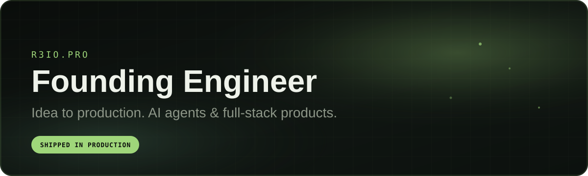
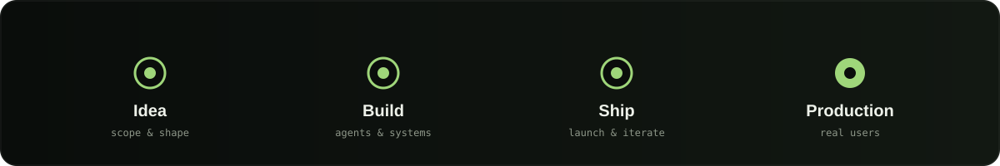
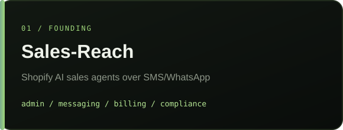
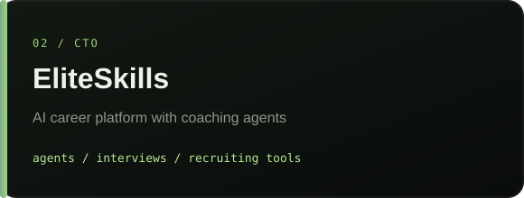
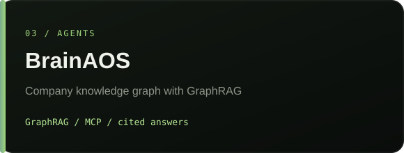
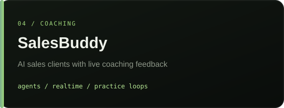
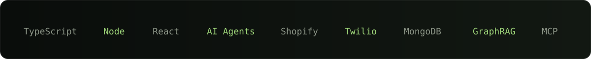

  

**Founding engineer** &nbsp;/&nbsp; Estonia &nbsp;/&nbsp; AI agents &amp; full-stack

[Portfolio](https://www.r3io.pro/) &nbsp;/&nbsp; [LinkedIn](https://www.linkedin.com/in/reio-vendelin/) &nbsp;/&nbsp; [Email](mailto:Reio.vend@gmail.com)

 

  

### Selected work

<table>
  <tr>
    <td width="50%">
      
    </td>
    <td width="50%">
      
    </td>
  </tr>
  <tr>
    <td width="50%">
      
    </td>
    <td width="50%">
      
    </td>
  </tr>
</table>

 

  

  

More at <a href="https://www.r3io.pro/">r3io.pro</a>

